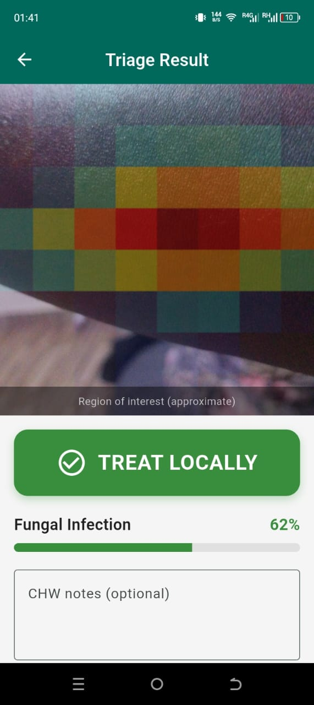
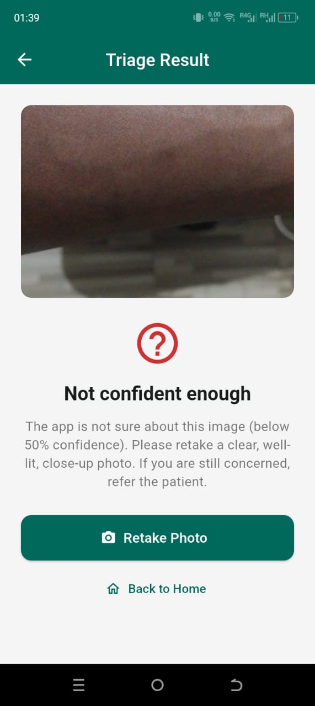
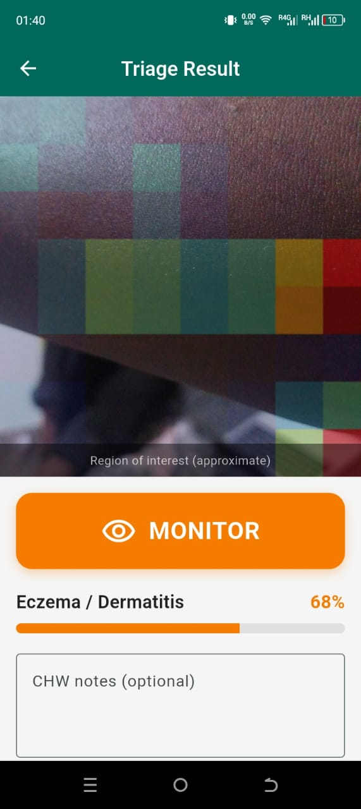
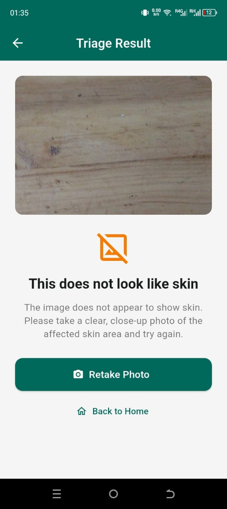
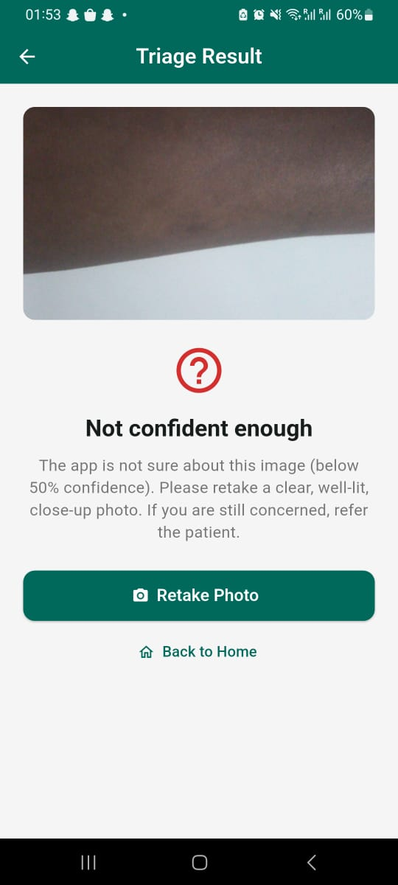
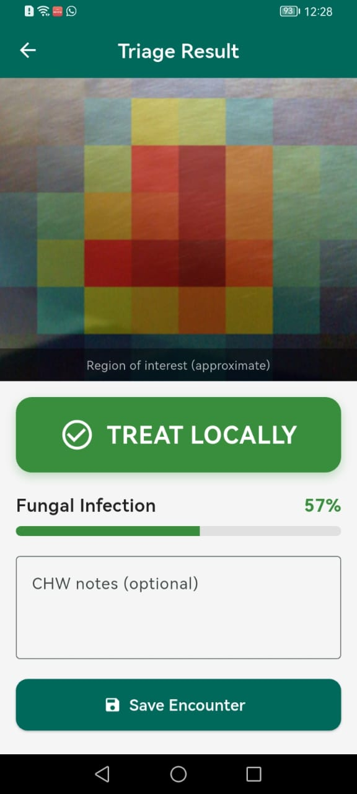
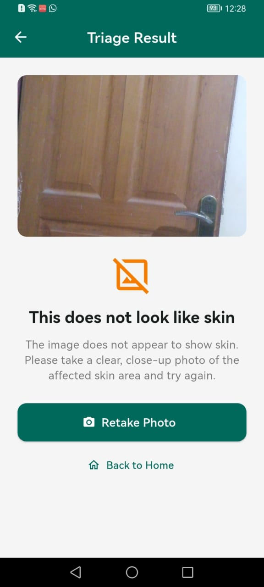
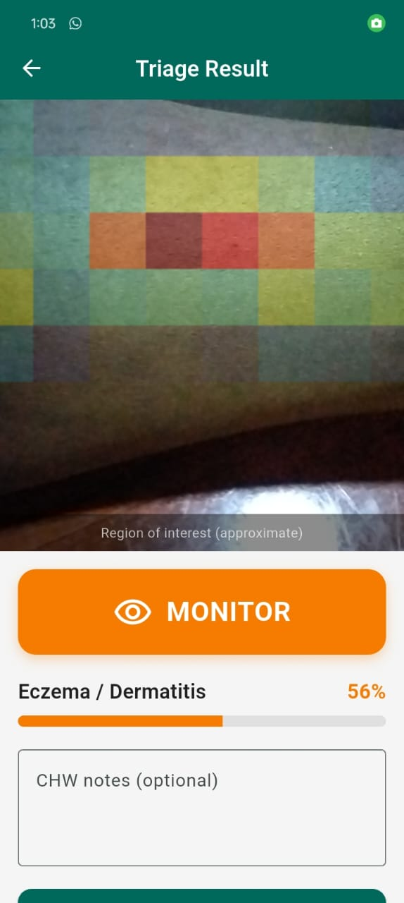

# DermaTriage Rwanda

**A lightweight, offline-capable skin-condition triage tool for Community Health Workers (CHWs) in Rwanda.**

DermaTriage is a BSc Software Engineering capstone project (African Leadership University). It pairs an on-device deep-learning image classifier with an offline Android application, enabling community health workers to capture a skin image and receive a triage suggestion for three common conditions — **Fungal infection, Scabies, and Eczema** — without requiring an internet connection at the point of care. The project places particular emphasis on **equitable performance across skin tones** (Fitzpatrick types IV–VI), which are historically under-represented in dermatology datasets and AI systems.

---

## Demo Video

A walkthrough of the DermaTriage app in action:

[](https://youtu.be/XlURTichBIE)

▶️ **[Watch the demo on YouTube](https://youtu.be/XlURTichBIE)**

---

## Table of Contents
1. [Motivation](#motivation)
2. [Key Features](#key-features)
3. [System Overview](#system-overview)
4. [Repository Structure](#repository-structure)
5. [The Machine Learning Pipeline](#the-machine-learning-pipeline)
6. [Results](#results)
7. [The Mobile Application](#the-mobile-application)
8. [Setup & Installation](#setup--installation)
9. [How to Reproduce the Models](#how-to-reproduce-the-models)
10. [Deployment (PyTorch → TFLite)](#deployment-pytorch--tflite)
11. [Limitations & Honest Findings](#limitations--honest-findings)
12. [Future Work](#future-work)
13. [Ethics & Responsible Use](#ethics--responsible-use)
14. [Acknowledgements](#acknowledgements)

---

## Motivation

Access to dermatological expertise is severely limited in many rural areas of Rwanda, where community health workers are often the first and only point of contact for patients. Skin conditions are common but require visual expertise to triage correctly. This project asks: *can a lightweight AI model, running entirely offline on an inexpensive Android phone, help CHWs triage common skin conditions — and do so fairly across the darker skin tones that dominate the local population?*

Two constraints shape every design decision:
- **Offline-first:** connectivity cannot be assumed at the point of care. Inference must run on-device.
- **Equity:** the tool must perform comparably across Fitzpatrick skin types IV–VI, not just lighter skin.

---

## Key Features

- **On-device inference** — a distilled MobileNetV3-Small model runs locally; no internet needed for triage.
- **Three-condition triage** — Fungal, Scabies, Eczema.
- **Robust input rejection** — the model declines to diagnose non-skin images and (where possible) healthy skin, rather than forcing an incorrect diagnosis.
- **Equity-aware evaluation** — performance is reported stratified by Fitzpatrick skin type, with an explicit dark-skin disparity metric.
- **Knowledge distillation** — a larger EfficientNet-B0 teacher is compressed into a deployable MobileNetV3-Small student.
- **Explainability** — Grad-CAM heatmaps show which image regions drove each prediction.
- **Online authentication with offline session** — CHWs authenticate online (enabling user tracking and account management), then use the app offline.
- **Deployment Viability Score (DVS)** — a composite metric balancing accuracy, model size, latency, and equity for deployment decisions.

---

## System Overview

```
   ┌──────────────────────────┐         ┌───────────────────────────┐
   │   Flutter Android App     │         │   Model Training (Kaggle) │
   │                           │         │                           │
   │  • Online auth (Firebase) │         │  • PASSION dataset         │
   │  • Offline session        │         │  • EfficientNet-B0 teacher │
   │  • On-device TFLite model │◀────────│  • Distill → MobileNetV3   │
   │  • Triage + rejection     │  .tflite│  • Grad-CAM, DVS           │
   │  • Grad-CAM (report)      │         │                           │
   └──────────────────────────┘         └───────────────────────────┘
```

---

## Repository Structure

```
dermatriage-rwanda/
├── README.md                          # this file
├── app/                               # Flutter Android application
│   ├── lib/                           # Dart source (screens, auth, inference)
│   ├── assets/                        # bundled .tflite model + labels
│   └── pubspec.yaml
├── notebooks/                         # ML experiments (Kaggle/Colab)
│   ├── experiment_2_extended.ipynb              # 4-class architecture comparison
│   ├── experiment_3class_efficientnet.ipynb     # 3-class (Others dropped), EfficientNet
│   ├── experiment_3class_efficientnet_resnet.ipynb  # 3-class, EfficientNet vs ResNet
│   ├── experiment_5class_robust.ipynb           # + rejection classes (healthy_skin, not_skin)
│   ├── experiment_distillation.ipynb            # EfficientNet-B0 → MobileNetV3 distillation
│   ├── experiment_gradcam.ipynb                 # Grad-CAM explainability
│   ├── retrain_diverse_notskin.ipynb            # diverse ImageNet negatives + OOD verification
│   ├── test_model_on_images.ipynb               # qualitative testing / reference numbers
│   ├── convert_model_aiedge.ipynb               # PyTorch → TFLite (litert-torch)
│   └── convert_model_to_tflite.ipynb            # PyTorch → ONNX → TFLite (legacy path)
├── models/                            # trained checkpoints (.pth) and converted .tflite
└── docs/                              # report, model comparison, figures
```

> Adjust paths to match your actual layout; the structure above reflects the intended organisation.

---

## The Machine Learning Pipeline

The classifier was developed through a series of controlled experiments, each building on the last. All experiments use **patient-level train/validation/test splits** (80/10/10) to prevent data leakage — images from the same patient never appear across splits.

### Dataset
- **PASSION (MICCAI 2024)** — clinical skin images from African patients, labelled by condition and Fitzpatrick skin type. Filtered to the three target conditions (Fungal, Scabies, Eczema), yielding ~2,800 images across Fitzpatrick types IV–VI.
- **Rejection-class data (for robustness):**
  - `not_skin` — diverse non-skin images (an ImageNet subset) so the model learns to reject arbitrary inputs (objects, scenes, etc.).
  - `healthy_skin` — normal-skin images so the model can flag skin that is not one of the target conditions.

### Experiment progression
1. **Architecture comparison (4-class).** CNN-from-scratch, MobileNetV3-Small, EfficientNet-B0, and ResNet-18 trained under an identical protocol. Pre-trained models decisively beat the from-scratch CNN.
2. **3-class focus.** The heterogeneous *Others* class was dropped to concentrate on the three clinically actionable conditions — a deliberate, clinically-motivated scoping decision.
3. **Robustness (5-class).** Added `healthy_skin` and `not_skin` rejection classes so the model declines to diagnose inappropriate inputs.
4. **Knowledge distillation.** The best-performing model (EfficientNet-B0) was used as a *teacher* to train a smaller MobileNetV3-Small *student*, transferring performance into a deployable footprint.
5. **Explainability.** Grad-CAM was applied to the final model to verify it attends to lesions rather than background artefacts.

### Evaluation metrics
Every model is evaluated on **accuracy, macro-F1, per-class precision/recall/F1, a confusion matrix, and Fitzpatrick-stratified accuracy** with a **dark-skin disparity** value (max−min accuracy across types IV–VI). For a triage tool, **per-class recall is the safety-critical metric** — a false negative (missing a real condition) is more dangerous than a false positive.

---

## Results

### Architecture comparison (3-class, PASSION)
| Model | Test Acc | Macro-F1 | Dark disparity | Params |
|---|---|---|---|---|
| EfficientNet-B0 | 0.7775 | 0.7683 | 0.072 | 4.01M |
| ResNet-18 | 0.7828 | 0.7743 | 0.057 | 11.18M |

### Robust 5-class model (with rejection classes)
| Model | Test Acc | Macro-F1 | not_skin recall | Dark disparity | Params |
|---|---|---|---|---|---|
| **EfficientNet-B0 (teacher)** | 0.8537 | 0.8683 | 1.00 | 0.062 | 4.01M |
| ResNet-18 | 0.8311 | 0.8473 | 1.00 | 0.073 | 11.18M |

### Knowledge distillation (the deployable model)
| Model | Test Acc | Eczema recall | Dark disparity | Params |
|---|---|---|---|---|
| Teacher (EfficientNet-B0) | 0.8537 | 0.710 | 0.062 | 4.01M |
| Student baseline (no distill) | 0.7936 | 0.449 | 0.138 | 1.52M |
| **Student distilled** | **0.8368** | **0.729** | **0.069** | **1.52M** |

**Distillation recovered ~72% of the teacher–student accuracy gap at ~38% of the teacher's parameters.** It also dramatically improved the deployable model's Eczema recall (0.45 → 0.73, exceeding the teacher) and halved its dark-skin disparity (0.138 → 0.069, matching the teacher) — demonstrating that distillation preserved both diagnostic performance **and** skin-tone equity in a compressed, on-device-suitable model.

> Exact numbers depend on the random seed and data version; the values above are representative of the reported runs.

---

## The Mobile Application

A Flutter Android application provides the CHW-facing interface.

- **Authentication (online):** Firebase Authentication handles registration, login, and account management. Authenticating online allows the project owner to track registered users; CHWs can update their profile and password. After the first online login, the session persists locally so the app opens straight into triage **offline**.
- **Triage (offline):** the CHW captures or selects a skin image; the bundled TFLite model runs **entirely on-device**. The app displays the predicted condition and confidence.
- **Rejection logic:** if the prediction is `not_skin` or `healthy_skin`, or if confidence is below a threshold, the app shows an appropriate message ("not a skin condition" / "please retake") instead of a diagnosis.

**Critical implementation note — preprocessing must match training exactly:** resize to 224×224, scale to `[0,1]` (divide by 255), then normalise with ImageNet mean `[0.485, 0.456, 0.406]` and std `[0.229, 0.224, 0.225]`. The model's class index order is fixed: `0=Fungal, 1=Scabies, 2=Eczema, 3=healthy_skin, 4=not_skin`. Any mismatch in preprocessing or class order will silently corrupt predictions. See `deployment_info.json` produced by the conversion notebook.

### Real-Device Testing

The app was tested on four low-to-mid-range Android phones — representative of the inexpensive hardware CHWs are likely to use in the field. All screenshots below were captured on-device.

#### Device 1 — Itel P55 · Android v13 · 4 GB RAM

<p align="left">
  
  
  
  
</p>

#### Device 2 — Samsung 32 · 4 GB RAM

<p align="left">
  
</p>

#### Device 3 — Huawei · EMUI v12 · 6 GB RAM

<p align="left">
  
  
</p>

#### Device 4 — Oppo A3x · 4 GB RAM

<p align="left">
  
</p>

---

## Setup & Installation

### Prerequisites
- Python 3.10+ (for notebooks)
- Flutter SDK 3.x and Android Studio (for the app)
- A Firebase project (for authentication)
- A GPU environment (Kaggle / Google Colab) for training

### Notebooks
```bash
# Recommended: run on Kaggle or Colab with a GPU.
# Locally:
pip install torch torchvision scikit-learn matplotlib seaborn pandas pillow opencv-python
```

### Flutter app
```bash
cd app
flutter pub get
# Add your Firebase config (google-services.json) to android/app/
flutter run
```

### Firebase setup
1. Create a project at the Firebase console.
2. Add an Android app; download `google-services.json` into `app/android/app/`.
3. Enable Email/Password authentication.
4. Registered-user counts appear in the Firebase console's Authentication tab.

---

## How to Reproduce the Models

Run the notebooks in this order:

1. `retrain_diverse_notskin.ipynb` — trains the teacher (EfficientNet-B0) and the distilled student (MobileNetV3-Small) on PASSION + diverse `not_skin` (ImageNet subset) + `healthy_skin`, with an out-of-distribution verification step. **This is the primary training notebook** and produces the deployable model.
2. `experiment_gradcam.ipynb` — generates Grad-CAM explainability figures on the trained model.
3. `test_model_on_images.ipynb` — qualitative testing and reference numbers for verifying the app's preprocessing.

Earlier experiments (`experiment_2_extended`, `experiment_3class_*`, `experiment_5class_robust`, `experiment_distillation`) document the development journey and the controlled comparisons behind the final design.

---

## Deployment (PyTorch → TFLite)

The PyTorch model is converted to TensorFlow Lite for on-device Flutter inference.

- **Recommended:** `convert_model_aiedge.ipynb` — uses Google's current `litert-torch` (formerly `ai-edge-torch`) for a direct PyTorch → TFLite conversion.
- **Legacy:** `convert_model_to_tflite.ipynb` — the ONNX → TensorFlow → TFLite path (note: `onnx-tf` is deprecated and may fail on current environments).

**Run conversion in a clean session** (separate from training) to avoid PyTorch/TensorFlow dependency conflicts. Every conversion notebook includes a **numerical equivalence check** confirming the TFLite model reproduces the PyTorch model's predictions before deployment.

---

## Limitations & Honest Findings

This project documents its limitations transparently, as honest evaluation is core to responsible ML.

- **Rejection generalisation.** The `not_skin` class initially failed to generalise: trained only on CIFAR-100, the model rejected held-out CIFAR images perfectly (100% recall) but misclassified genuinely diverse inputs (astronomical images, people, vegetation) as diseases. Retraining with a diverse ImageNet subset substantially improved this. **Lesson: a rejection class is only as good as the diversity of its negative examples.** The space of "not skin" is open-ended and cannot be fully covered.
- **Healthy vs. diseased skin.** Distinguishing healthy skin from mild disease is intrinsically subtle. Additionally, the healthy-skin training data was sourced from a **facial** skin dataset, differing in body region from the clinical (body-skin) disease images — a distribution mismatch that reduces reliability on healthy body skin.
- **Face inputs.** Because the diverse ImageNet negatives contain many images of people, the model may flag faces as `not_skin`. As the tool is scoped for **body-skin triage**, flagging out-of-scope inputs for retake is a reasonable — if imperfect — behaviour.
- **Diagnostic accuracy is not clinical-grade.** At ~84% accuracy with imperfect per-class recall, this is a **research prototype and triage aid**, not a diagnostic device. It must not replace professional medical judgement.
- **On-device explainability.** Grad-CAM requires gradients, which TFLite does not readily support on-device; Grad-CAM analysis is therefore provided in the notebooks/report rather than as a live in-app feature.

---

## Future Work

- Broader, more representative **healthy body-skin** data across skin tones and body regions.
- A dedicated **out-of-distribution / uncertainty mechanism** (e.g. energy-based OOD, confidence-referral thresholds) so ambiguous inputs are escalated to a human rather than force-classified.
- **Synthetic augmentation** (conditional GAN / diffusion) for the most under-represented dark-skin conditions, with the augmentation loop closed and measured.
- **On-device latency benchmarking** to validate the Deployment Viability Score with real device measurements.
- Expansion to additional conditions and prospective **clinical validation** with medical partners.

---

## Ethics & Responsible Use

DermaTriage is a **decision-support prototype**, not a medical device. It is intended to *assist* trained community health workers, not to provide autonomous diagnosis. Predictions can be wrong, including confidently wrong, and must always be reviewed by a qualified human. The project deliberately foregrounds **equity across skin tones**, but fairness on the evaluated data does not guarantee fairness on all populations. Any real-world deployment would require clinical validation, regulatory review, patient consent, and data-governance safeguards.

---

## Acknowledgements

- **PASSION dataset** (MICCAI 2024) for clinical skin images from African patients.
- **Fitzpatrick 17k** and **ISIC** communities for dermatology dataset resources referenced during development.
- Supervisor **Emmanuel Annor** and the ALU faculty for guidance.
- Open-source communities behind PyTorch, TorchVision, TensorFlow Lite, and Flutter.

---
